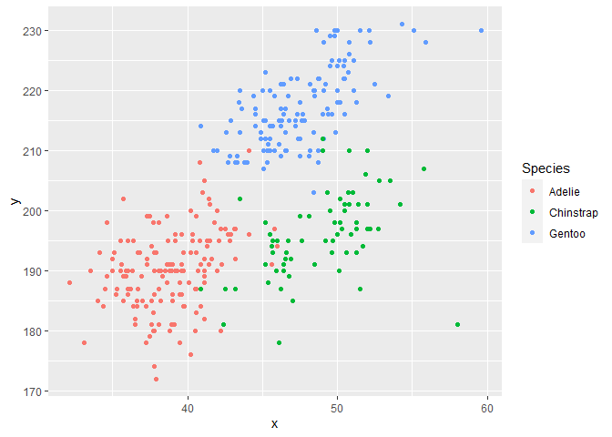

HW 1
================

## Problem 1

#### Description of “penguins” dataset

The name of the penguins dataset is species, island, bill_length_mm,
bill_depth_mm, flipper_length_mm, body_mass_g, sex, year. This data set
contains physical traits information about the different species of
penguins in some islands.

There are 344 observations and 8 variables in this dataset.

The means flipper length is 200.9152047

#### Scatterplot

``` r
penguins_plot_df = tibble(
  x = penguins$bill_length_mm,
  y = penguins$flipper_length_mm,
  Species = penguins$species
)

ggplot(penguins_plot_df, aes(x = x, y = y, color = Species)) + geom_point()
```

    ## Warning: Removed 2 rows containing missing values (geom_point).

<!-- -->

``` r
ggsave("penguins_plot.pdf", height = 4, width = 6)
```

    ## Warning: Removed 2 rows containing missing values (geom_point).

## Problem 2

#### Data frame & mean calculation

``` r
problem2_df = tibble(
  norm_samp = rnorm(10, mean = 0, sd = 1),
  vec_logical = norm_samp > 0,
  vec_char = c("One", "Two", "Three", "Four", "Five", "Six", "Seven", "Eight", "Nine", "Ten"),
  vec_factor = factor(c("High", "Low", "Low", "Medium", "High", "High", "Medium", "Medium", "Low", "Medium"))
)

problem2_df
```

    ## # A tibble: 10 × 4
    ##    norm_samp vec_logical vec_char vec_factor
    ##        <dbl> <lgl>       <chr>    <fct>     
    ##  1   -0.723  FALSE       One      High      
    ##  2    0.186  TRUE        Two      Low       
    ##  3    0.671  TRUE        Three    Low       
    ##  4   -1.45   FALSE       Four     Medium    
    ##  5    2.12   TRUE        Five     High      
    ##  6   -0.482  FALSE       Six      High      
    ##  7    0.218  TRUE        Seven    Medium    
    ##  8   -0.0542 FALSE       Eight    Medium    
    ##  9   -0.466  FALSE       Nine     Low       
    ## 10    0.973  TRUE        Ten      Medium

``` r
mean(problem2_df$norm_samp)
```

    ## [1] 0.09986607

``` r
mean(problem2_df$vec_logical)
```

    ## [1] 0.5

``` r
mean(problem2_df$vec_char)
```

    ## Warning in mean.default(problem2_df$vec_char): argument is not numeric or
    ## logical: returning NA

    ## [1] NA

``` r
mean(problem2_df$vec_factor)
```

    ## Warning in mean.default(problem2_df$vec_factor): argument is not numeric or
    ## logical: returning NA

    ## [1] NA

In this dataframe, we can calculate the mean if the vector is numeric or
logical, and we cannot calculate the mean when the vector is character
or factor.

#### Convert variable & discussion

``` r
#Convert logical to numeric
convert_logical = as.numeric(problem2_df$vec_logical)

#Convert character to numeric
convert_char = as.numeric(problem2_df$vec_char)
```

    ## Warning: NAs introduced by coercion

``` r
#Convert factor to numeric
convert_factor = as.numeric(problem2_df$vec_factor)
```

Using thr `as.numeric` function, I was able to convert logical and
factor vectors into numeric vector. However, when I tried to convert the
character vector, I received the warning message saying
`"NAs introduced by coercion"`.

For logical vector, the option is either `TRUE` or `FALSE`. So R assigns
numeric value to these two options and we are able to find the means of
the logical vector.

For character vector, it is impossible to calculate the mean or convert
it to numeric and calculate the mean.

For factor vector, since there are 3 “levels” in the dataframe, it is
possible to convert it into a numeric vector and calculate mean that
way.
